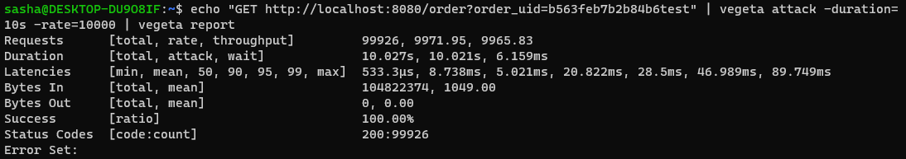

[](https://github.com/Proxypepe/wb-web/actions/workflows/go.yml)

# Web wb

## Содержание

1. [Запуск](#Запуск)
2. [Задание](#Задание)
3. [Тестирование производительности](#тестирование-производительности)

## Запуск

Для запуска необходим docker и docker compose  
Команда:

```sh
docker-compose up -d
```

Порты

1. localhost:8080 - Доспуп к бэку
2. localhost:3000 - Доступ к фронту

Пример запроса к бэку

```sh
curl http://localhost:8080/order?order_uid=b563feb7b2b84b6test
```

Одна запись добавляется при инициализации таблиц. Индекс записи указан в примере

## Задание

В БД:

1.
    - [x] Развернуть локально postgresql
2.
    - [x] Создать свою бд
3.
    - [x] Настроить своего пользователя.
4.
    - [x] Создать таблицы для хранения полученных данных.

В сервисе:

1.
    - [x] Подключение и подписка на канал в nats-streaming
2.
    - [x] Полученные данные писать в Postgres
3.
    - [x] Так же полученные данные сохранить in memory в сервисе (Кеш)
4.
    - [x] В случае падения сервиса восстанавливать Кеш из Postgres
5.
    - [x] Поднять http сервер и выдавать данные по id из кеша
6.
    - [x] Сделать простейший интерфейс отображения полученных данных, для
      их запроса по id

Доп инфо:

- Данные статичны, исходя из этого подумайте насчет модели хранения
  в Кеше и в pg. Модель в файле model.json
- В канал могут закинуть что угодно, подумайте как избежать проблем
  из-за этого
- Чтобы проверить работает ли подписка онлайн, сделайте себе
  отдельный скрипт, для публикации данных в канал
- Подумайте как не терять данные в случае ошибок или проблем с
  сервисом
- Nats-streaming разверните локально ( не путать с Nats )

## Тестирование производительности
Тестирование проходило с помощью утилиты vageta

  
  
  
  
  


